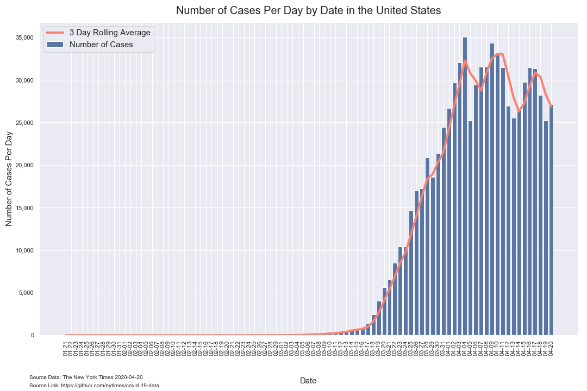
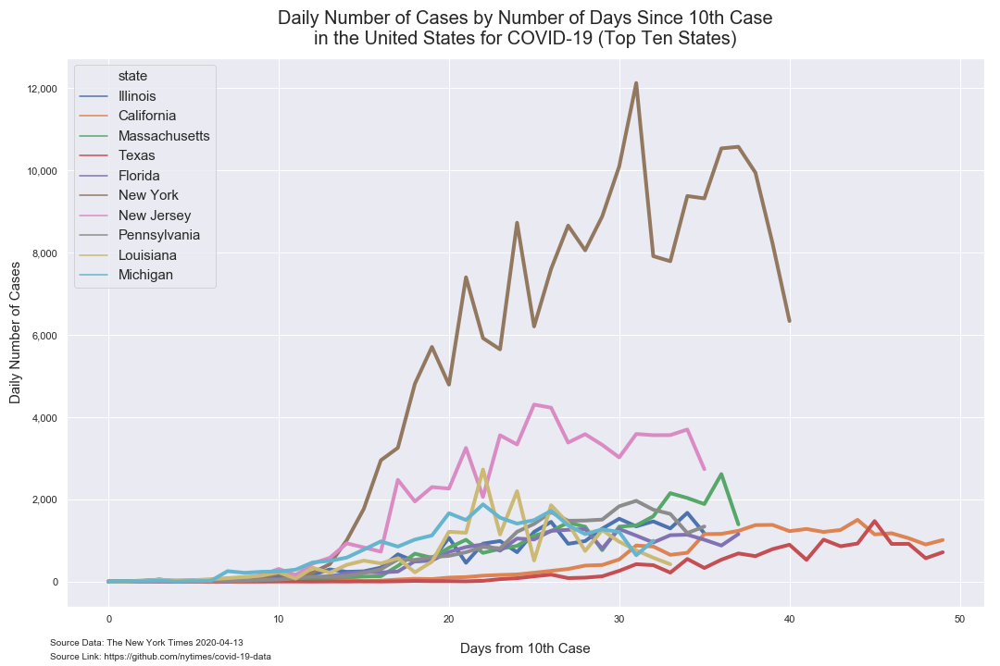
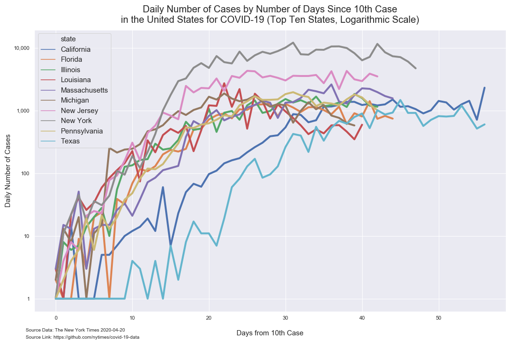
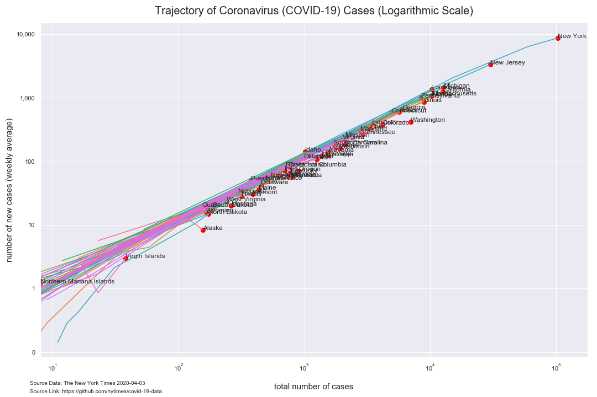

# Analysis of COVID-19 Data from The New York Times

*Author: Mark Bauer*  
*Date Created: March 28, 2020*  
*Date Updated: April 18, 2020*

The New York Times Github Data Repository: https://github.com/nytimes/covid-19-data.   
The New York Times News Article: https://www.nytimes.com/article/coronavirus-county-data-us.html.  
The New York Times COVID-19 US Map: https://www.nytimes.com/interactive/2020/us/coronavirus-us-cases.html.   
The New York Times COVID-19 Global Map: https://www.nytimes.com/interactive/2020/world/coronavirus-maps.html.  

 

# Tables

**Table 1. Coronavirus (COVID-19) Cases in the United States (Top 10 States)**

|    | date       | state         | cases   | deaths   |
|---:|:-----------|:--------------|--------:|---------:|
|  0 | 2020-04-17 | New York      | 229,642 | 12,822   |
|  1 | 2020-04-17 | New Jersey    | 78,467  | 3,840    |
|  2 | 2020-04-17 | Massachusetts | 34,402  | 1,404    |
|  3 | 2020-04-17 | Pennsylvania  | 30,121  | 1,027    |
|  4 | 2020-04-17 | Michigan      | 29,952  | 2,226    |
|  5 | 2020-04-17 | California    | 29,398  | 1,050    |
|  6 | 2020-04-17 | Illinois      | 27,575  | 1,142    |
|  7 | 2020-04-17 | Florida       | 24,745  | 726      |
|  8 | 2020-04-17 | Louisiana     | 23,118  | 1,213    |
|  9 | 2020-04-17 | Texas         | 18,130  | 461      | 

# Bar Charts

 

   

# Figures

##  Number of Positives Per Day

### Weekly Average

 

### Daily

##  Growth Factor of Number of Positives per Day

### Weekly Average

### Daily 

## Cumulative Number of Positive Cases  

### Top 10 States

  

### All States

## Trajectory of Number of Positive Cases

   

 

## Time Series

### Top 10 States

### United States

  

## Maps

