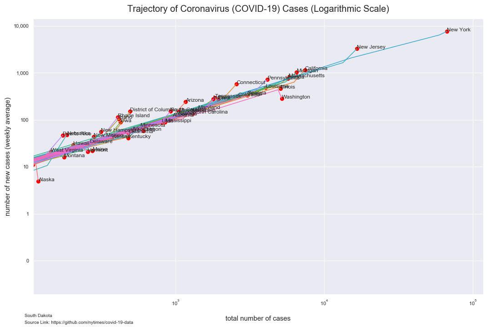
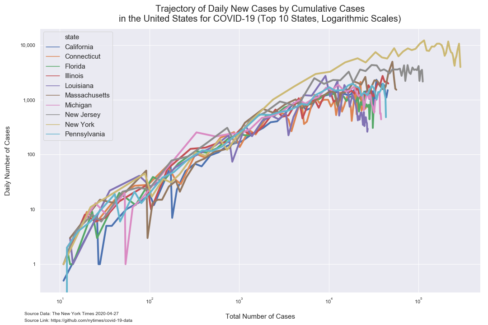
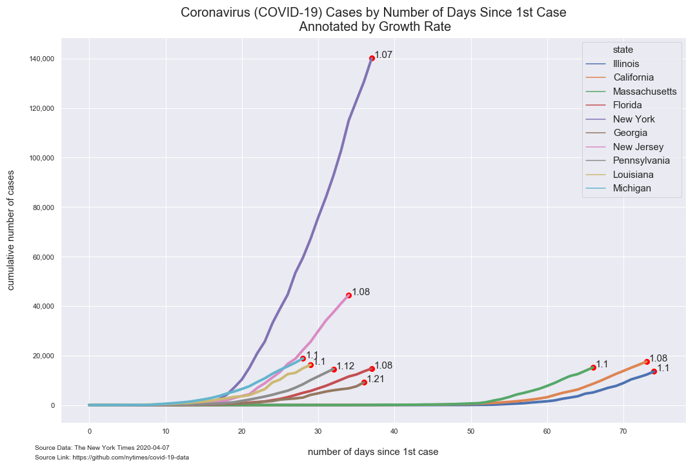
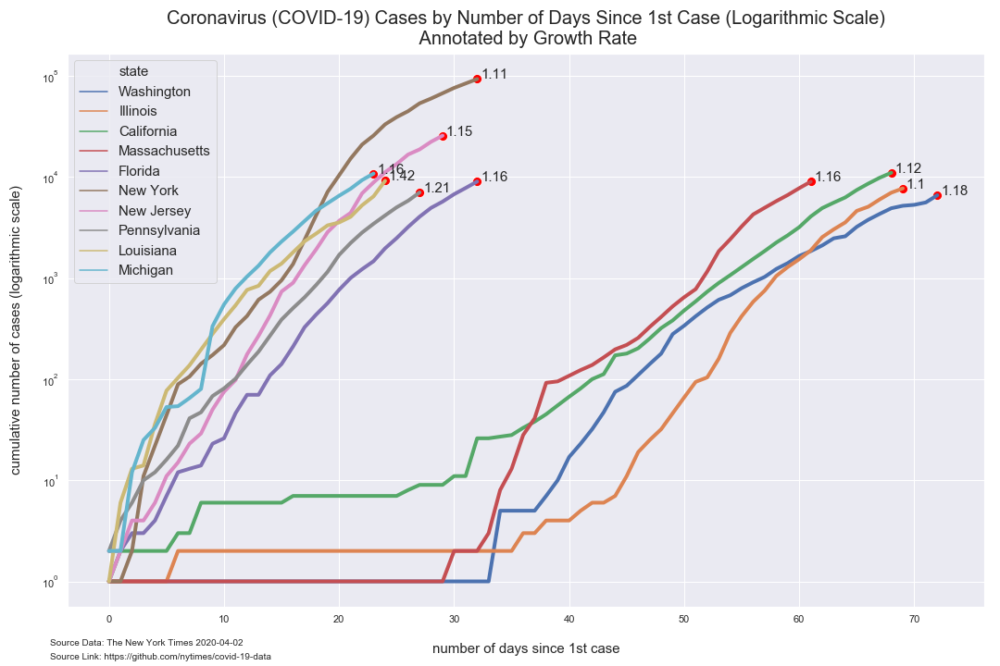

# Analysis of COVID-19 Data from The New York Times

*Author: Mark Bauer*  
*Date Created: March 28, 2020*  
*Date Updated: April 2, 2020*

The New York Times Github Data Repository: https://github.com/nytimes/covid-19-data.   
The New York Times News Article: https://www.nytimes.com/article/coronavirus-county-data-us.html.  
The New York Times COVID-19 US Map: https://www.nytimes.com/interactive/2020/us/coronavirus-us-cases.html.   
The New York Times COVID-19 Global Map: https://www.nytimes.com/interactive/2020/world/coronavirus-maps.html.  

 

# Tables

**Table 1. Coronavirus (COVID-19) Cases in the United States (Top 10 States)**

|    | date       | state         | cases   | deaths   |
|---:|:-----------|:--------------|--------:|---------:|
|  0 | 2020-04-01 | New York      | 83,889  | 1,941    |
|  1 | 2020-04-01 | New Jersey    | 22,255  | 355      |
|  2 | 2020-04-01 | California    | 9,816   | 212      |
|  3 | 2020-04-01 | Michigan      | 9,293   | 336      |
|  4 | 2020-04-01 | Florida       | 7,765   | 100      |
|  5 | 2020-04-01 | Massachusetts | 7,738   | 122      |
|  6 | 2020-04-01 | Illinois      | 6,980   | 146      |
|  7 | 2020-04-01 | Louisiana     | 6,424   | 273      |
|  8 | 2020-04-01 | Pennsylvania  | 5,805   | 74       |
|  9 | 2020-04-01 | Washington    | 5,588   | 249      |  

# Figures

## Trajectory of COVID-19 Cases

  

# Additional Figures

## Time Series

  

## Bar Charts

## Maps

## Tree Maps

